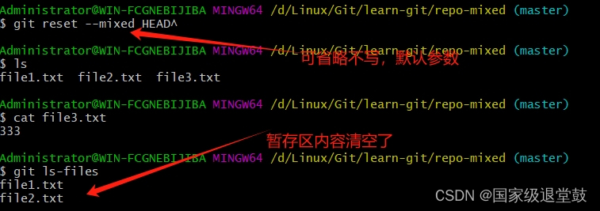
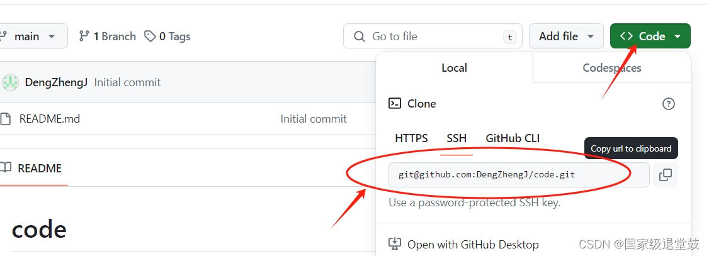

还没完成

D:\Private\test：本地管理仓库地址


Git：一个开源的 分布式版本控制系统，它可以在本地和远程仓库之间管理源代码和文档的版本。推荐有Linux基本命令的基础学习更佳，学起来不会枯燥、乏味。

# 1. 初始化配置

Git安装网址:[Git - Downloads (git-scm.com)](https://git-scm.com/downloads)
安装完成后，找到键盘Win键按下后，在开始菜单中找到刚下载好的Git Bash打开git命令行窗口，准备输入后续命令


查看Git版本，检测是否安装成功

```c
git --version
```

配置用户名和邮箱，保存用户名和密码，不用每一次都输入。

```c
git config --global user.name "Deng ZJ"
git config --global user.email Deng@gmail.com
git config --global credentia.helper store
```

**为什么要配置用户名和邮箱？**
答：远程仓库里需要记录这些提交记录是由谁来完成的；所以我们需要给本地的git设置用户名和邮箱，用于从本地仓库向远程仓库提交记录时，在远程仓库记录下这些操作是由谁来完成的。

`git config --global credentia.helper store` ：这个命令用于配置 Git，使其使用一个叫做 store 的凭据助手。这个凭据助手的作用是将你的凭据（用户名和密码）永久性地存储在磁盘上，以便 Git 后续可以自动使用这些凭据进行认证。

查看配置信息

```
git config --global --list
```

结果如下


# 2. 初始化仓库

创建仓库一般有两种方式
1、本地直接创建一个仓库
2、远程服务器上克隆一个存在的仓库

2-1 首先创建一个文件目录，切换文件路径

```c
mkdir learn-git
cd learn-git
```


在本地文件目录`learn-git`中执行命令 `git init`，将这个目录变成 Git 仓库。系统命令窗口回显已经**初始化**了一个空的仓库，且路径行出现一个master分支

```c
git init
```


输入` ls -a`，即查看当前目录下的文件(包括带.的隐藏文件)，-a参数：显示隐藏文件
其中.git隐藏文件里是get仓库的组成部分，不要随意增删改查


删除仓库，master标志也会消失

```c
rm -rf .git
```


2-2 新建仓库，取名为my-repo的仓库，就会在my-repo文件夹下生成仓库

```c
git init my-repo
```


进入my-repo仓库

```c
cd my-repo
```


2-3 Github远程使用git clone命令获取名为remote-repo的仓库

```c
git clone https://github.com/geekhall-laoyang/remote-repo.git
```


如何找到地址，举例：如下图所示


若连接克隆超时，可选用SSH地址，但需要事先把本机生成的SSH公钥配置到项目中**SSH配置讲解**[11.SSH配置和克隆仓库_哔哩哔哩_bilibili](https://www.bilibili.com/video/BV1HM411377j/?p=11&vd_source=3b56442de5423f47ec0cffcad097395c)


2-4 修改分支名master为main方法
在`C:\Users\Administrator`找到`.gitconfig`文件，打开后添加下面两行指令即可


```c
[init]
	defaultBranch = main
```


# 3. 工作区域和文件状态

工作区域分为：工作区、暂存区、本地仓库
**工作区**：本地计算机上存储项目代码的目录，所有文件都可以进行修改和编辑

**暂存区**（也称为索引区）： Git 用于存储将要提交到本地仓库的修改的地方，看作是一个缓冲区，用于暂时存储修改。

**本地仓库**：是指 Git 存储项目历史记录的地方，它保存了项目的每一次提交，每个提交都包含了一个快照和提交信息。本地仓库是工作区和暂存区的最终目的地，是 Git 进行版本控制的核心。


文件的三种状态:已修改（modified）,已暂存（staged）,已提交(committed)。


文件状态如下图所示：


# 4. 添加和提交文件

注：简洁版看本章结尾处
4-1 由于之前创建了一个仓库，现在来创建一个新的文件file1.txt，并输入hello world

```c
echo "hello world" > file1.txt
```


查看文件内容

```c
cat file1.txt
```


查看仓库的状态

```c
git status
```


添加到暂存区

```c
git add file1.txt
```


提交文件，只会提交暂存区的文件
再新创建一个文件file2.txt，进行提交文件时，只提交暂存区的file1.txt， ，-m参数：提交信息

```c
 git commit -m "第一次提交"
```


4-2 通过通配符`*`来`add`添加多个文件

```c
git add *.txt
```


4-3 添加当前文件夹的所有文件(用. 表示)到暂存区

```c
git add .
```

提交文件，不带m参数就会进入vim文件编辑器(不会使用需学习Linux基础知识)界面，首行编辑第二次提交即可，vim的使用方法自行查阅
进入界面，先输入i进入编辑界面，编辑文字这是第二次提交后，按Esc退出输入模式。进入命令模式，界面输入:wq即可

```c
git commit
```


查看提交历史记录

```c
git log
```


总结：

| git status                  | 查看仓库的状态                                               |
| --------------------------- | ------------------------------------------------------------ |
| git add                     | 添加到暂存区<br/>通配符添加多个以`.txt`结尾的文件 git add *.txt<br/>添加当前目录下的所有文件 git add . |
| git commit                  | 提交到本地仓库<br/>只提交`暂存区`的文件，不会提交工作区的    |
| git log                     | 查看仓库提交历史记录<br/>添加`--oneline`参数可查看简洁的历史记录 |
| git commit -a -m “输入信息” | 一次性完成添加和暂存                                         |


# 5. git reset 回退版本

三个参数 soft、hard、mixed

|                             | 工作区内容 | 暂存区内容 |
| --------------------------- | ---------- | ---------- |
| git reset --soft            | 保留       | 保留       |
| git reset --hard            | 清空       | 清空       |
| git reset --mixed(默认参数) | 保留       | 清空       |


创建一个名为repo的仓库，创建三个文件，并分别添加后提交共三次，并使用`git log --oneline`查看提交简洁记录


依次复制repo创建三个仓库

```c
cp -rf repo repo-soft
cp -rf repo repo-hard
cp -rf repo repo-mixed
```


进入命名为soft的仓库，进行soft方式的版本回退


5-1 --soft 后面接回退的版本号，那么我们回退到第二次提交的版本号

```c
 git reset --soft fe6c3eb
```


此时分别查看工作区和暂存区的情况，应当都是被保留的


5-2 --hard参数 HARD^ 表示回退到上一个版本

```c
git reset --hard 版本号
```


或者

```c
git reset -hard HEAD^
```


此时分别查看工作区和暂存区的情况，file3的文件应当都是被清空的


5-3 --mixed 默认参数可以不加
回退到上一个版本

```c
git reset --mixed HEAD^
```


此时工作区file3文件保留和暂存区文件清空




总结：

|                             | 工作区内容 | 暂存区内容 |
| --------------------------- | ---------- | ---------- |
| git reset --soft            | 保留       | 保留       |
| git reset --hard            | 清空       | 清空       |
| git reset --mixed(默认参数) | 保留       | 清空       |


# 6. git diff查看差异

查看工作区、暂存区、本地仓库之间的差异，查看不同版本之间的差异或者不同分支之间。
使用上一节创建的repo仓库，并里面vim命令修改file3.txt文件内容333变为4444后，使用命令查看差异
不加参数，默认比较工作区和暂存区之间的差异

```c
git diff
```


工作区和版本库之间的差异

```c
git diff HEAD
```

暂存区和版本库之间的差异

```c
git diff --cached
```

比较版本差异，只需要加入版本的ID即可

```c
git diff 9ff62d0 e27c26b
```

HEAD标志指向分支的最新节点，比较当前版本`HEAD`和上一个版本`HEAD^(HEAD~)`之间的差异

```c
git diff HEAD^ HEAD
或
git diff HEAD~ HEAD
```


# 7. 文件删除git rm

可以一次性删除工作区和暂存区的相同文件

```
git rm file2.txt
```


删除版本库的文件

```c
git rm --cached 文件名
```


删除的文件需要**提交**到版本库中，这样版本库中的文件才能被删除

```c
git commit -m "delete file"
```


# 8. .gitignore（未完成）

功能：

需要适当的忽略一些临时缓存文件或者敏感文件添加到版本库中

使用方法：

创建一个 .gitinore 文件。在.gitinore 文件里面写入需要忽略的文件全称，再进行添加、提交，这样就可以再提交时忽略需要忽略的文件


克隆仓库

```c
git clone 克隆地址
```


推送更新内容到远程仓库

```c
git push
```


拉取更新内容到本地仓库，并进行一次合并操作

```c
git pull
```


只拉去修改的内容到本地仓库

```c
git fetch
```


# 9. 分支基础


利用`GitKraken`图形化工具展现，可到git官网下载。

首先在main创建main1、2、3分别提交三次，在dev分支中创建dev1、dev2分别提交二次，然后在main中创建main4、main5提交二次。


查看当前仓库的所有分支

```
git branch
```


创建一个名为dev的新分支

```
git branch dev
```


切换到新的分支，两个都可

```
git checkout dev
或
git switch dev
```


未合并，所以main分支还是原来的内容

将不同的分支进行合并到当前分支，在master分支中合并dev分支

```
git merge dev
```


当一个分支已经被合并到其他分支时，就可以删除已经合并的分支，没有合并的用-D参数强制删除

```
git branch -d dev
```

| 查看分支列表 | git branch                                                   |
| ------------ | ------------------------------------------------------------ |
| 创建分支     | git branch 分支名                                            |
| 切换分支     | git switch 分支名                                            |
| 合并分支     | git merge 分支名                                             |
| 删除分支     | git branch -d 分支名(已合并)<br/>git branch -D 分支名(未合并) |

**Rebase**操作


以上笔记借鉴于b站视频，以备复习使用。参考：[【GeekHour】一小时Git教程_哔哩哔哩_bilibili](https://www.bilibili.com/video/BV1HM411377j/?spm_id_from=333.999.0.0&vd_source=3b56442de5423f47ec0cffcad097395c)


# 10. 应用

## 应用1、本地文件提交到远程仓库

首先进入github官网，点击右上角New按钮，新建一个仓库。


这里我以将本地的coco数据集文件上传到github为例进行演示

### 1、创建一个本地仓库，并将文件移动到本地仓库中


其他(后续学习中发现的方法)：

直接到远程仓库，复制链接，将其克隆到本地，也算是创建了仓库；然后将代码复制到该本地仓库，并上传

```
git clone git@github.com:DengZhengJ/code.git
```




### 2、提交到本地仓库

```c
git add .
git commit -m "first commit"
git log
```


### 3、上传到远程仓库

```c
git remote add origin git@github.com:DengZhengJ/coco-repo.git
git branch -M main
git push -u origin main
```


显示最后一行，即上传完成。刷新github界面就可以看见上传的本地文件


### 4、错误

若这个仓库并不是初始化的，而是你自己在github上克隆下来进行修改后想上传到自己的github上时，输入`git remote add origin git@github.com:xxxxxx.git`时，显示以下错误`error: remote origin already exists`，是因为一开始代码已经关联了远程仓库。


解决办法，删除之前关联的远程仓库即可

```
git remote rm origin
```


重新输入上面的3、提交到远程仓库的指令，即可完成

报错
原因：由于没有配置SSH密钥导致的，或者已经配置的SSH被覆盖了

解决方法：


### 5、报错


这个错误通常发生在你试图将本地的更改推送到远程仓库时，发现远程仓库有你没有的更新。错误提示建议你先拉（pull）远程仓库的更新，然后再尝试推送你的更改。

1、拉取远程更新并合并

```
git pull origin main
```


2、重新推送

```
git push origin main
```


## 应用2、生成密钥

远程仓库支持两种协议：SSH和HTTPS。SSH协议只认机器，需要使用公钥和私钥对来做权限的认证；HTTPS协议只认账号，需要使用账号密码来做权限的认证。

首先cd到用户目录的.ssh文件中

```c
cd ~/.ssh
```


输入指令生成密钥，回车。
输入文件名为`git_rsa`，防止将前一次默认的id_rsa覆盖，回车。
通过更改文件名的方式，SSH可以远程连接于不同设备。
最终会生成一个公钥文件和一个私钥文件。

```c
ssh-keygen -t rsa -b 4096
```


然后打开公钥文件git_rsa.pub，全部复制。
回到GitHub，点击右上角头像 →【Setting】→ 【SSH and GPG keys】→【New SSH key】将复制的内容粘贴到key的框中，标题名字任意。最后→【Add SSH key】


## 应用3、本地创建分支后mersg远程分支后上库push到新的远程分支

```c
git clone 地址 ----克隆基准仓库
git clone -b 分支名 地址----克隆特定分支
git branch ---查看当前本地分支   -r:远程分支 -a:本地和远程分支
git branch 名称 ----创建本地分支 -d:删除本地分支
git checkout 名称 ---切换分支
git checkout -b 名称 ---- 创建并切换分支
git merge 将远程分支合并到当前分支(合并前 更新远程分支的引用 git fetch origin)

上库到新分支
git add .
git commit
git push origin 1_bugfix:bugfix/TPR-1890 本地分支：远程分支(新命名)

```